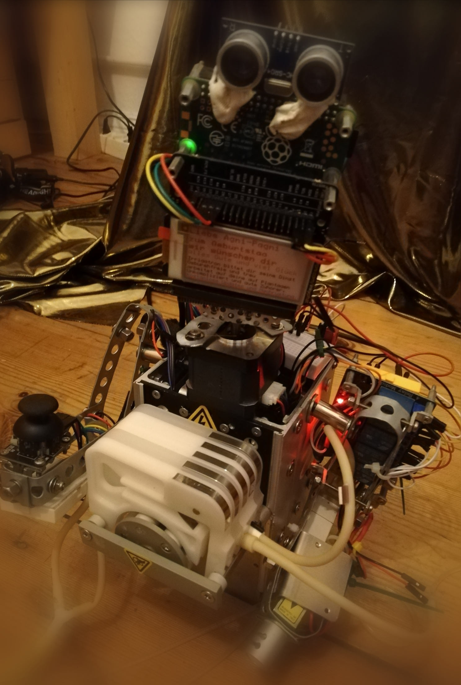

# `irrigatron` 

<p align="center">
  
</p>

* **Name:**  `Irrigatron`
* **Titul:** `Der Herr des Wasser und und die Pumpe`


🚧 _Work In Progress_ 🚧

![Minimum Rust Version][min-rust-badge]


## 🎙️ Commands

  - ### 🦀⚙️ `phatsys`
    run driver and wath socket for connections.
    All of the arguments and flags to this command are optional:

        Build your project. This command wath link to `ndir1` directory
        with the `"type"` declared there.

  - ### 🔧 `irrigatron`
        - `range`: defaults to `start:0.0, end: 1.0`
        - `bautrate`: default `57600`
        - `uart`:  defaults to `1` and iterate in `1..4`
      Configure sensor for user.

    ```
    wqa config --uart=2 --path=`test1`
    ```

  - ### 🔬 🕵️‍♀️ `check`: run this command to confirm that your configuration is appropriately set up.


## 🔩 Configuration

`init` initialize directory.

## Building

1. Install `cargo`:

    Edinburgh is installed through [Cargo](https://github.com/rust-lang/cargo#compiling-from-source), a Rust package manager. Rustup, a tool for installing Rust, will also install Cargo. On Linux and macOS systems, `rustup` can be installed as follows:

    ```
    curl https://sh.rustup.rs -sSf | sh
    ```

    Additional installation methods are available [here](https://forge.rust-lang.org/other-installation-methods.html).

2. Install on linux:

  - ### `i686`
      Step 1: Install the C cross toolchain
    ```sh
      sudo apt-get install -qq gcc-multilib-i686-linux-gnu
    ```
  - ### `arm`
    Step 1: Install the C cross toolchain
    ```sh
      sudo apt-get install -qq gcc-arm-linux-gnueabihf
    ```
     Additional installation methods are available [here](https://forge.rust-lang.org/other-installation-methods.html).
    Be sure to switch back to `stable` with `rustup default stable` if that's your preferred toolchain.

    To cross-compile for the PanelPC you will need an
    `i686-unknown-linux-gnu` GCC toolchain and Rust component installed. Add the Rust target
    with `rustup target add i686-unknown-linux-gnu`. Then you can
    cross-compile with `cargo`:

    ```
        cargo build --release --target i686-unknown-linux-gnu
    ```
    or arm:
    ```
        cargo build --release --target arm-unknown-linux-gnueabihf


To cross-compile for the Raspberry Pi you will need an
`arm-unknown-linux-gnueabihf` GCC toolchain and Rust component installed. On
Arch Linux I built [arm-linux-gnueabihf-gcc] from the AUR. Add the Rust target
with `rustup target add arm-unknown-linux-gnueabihf`. Then you can
cross-compile with `cargo`:


After it is built copy `target/arm-unknown-linux-gnueabihf/release/lca2019` to
the Raspberry Pi.


## Running

View the options with `./lca2019 -h`. By default it will try to bind the
webserver to port 80. You can give a regular user the permission to do this
with:

    sudo setcap cap_net_bind_service=ep lca2019

Alternatively use `-p` to set the port to a non-privileged one.

### Systemd Service

Copy `irrigatron.service` to `/etc/systemd/system/`.

    sudo systemctl daemon-reload
    sudo setcap cap_net_bind_service=ep lca2019
    sudo systemctl enable --now lca2019


<!-- Badges -->
[issue]: https://img.shields.io/github/issues/smolkov/automata?style=flat-square
[min-rust-badge]: https://img.shields.io/badge/rustc-1.38+-blue.svg
